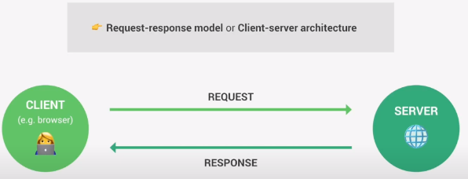

<a name="readme-top"></a>

# Name Repository

> Description.

## Built With

- Html
- Css
- JavaScript
- Vue 


## Live Demo (if available)

[Portfolio](https://gioudi.github.io/repository)

## Getting Started

To get a local copy up and running follow these simple example steps.

### Prerequisites

--Node 
--Npm 
--Composer 
--Text editor (VsCode)

### Install

1. Clone the repo
   ```sh
   git clone git@github.com:gioudi/repository.git
   ```
2. Install NPM packages
   ```sh
   npm install
   ```
   ```sh
   yarn install
   ```
## Codigo de instalacion de versiones de slugify

npm outdated para desactualizar 
npm slugify@ (version deseada)

versiones: 1.0.0, 1.6.6


## Introduccion a Back End Web

<h2>¿Que sucede realmente cada vez qye escribimos una URL en nuestro navegador para abrir una nueva pagina web O cada vez que solicitamos datos de alguna Api?</h2>

nuestro navegador, que tambien se llama cliente, envia una solicitud al servidor donde esta alojada la pagina web y el servidor enviara una respuesta, que contendra la pagina web que acabos de soliciatar. 



Digamos que queremos acceder a Google Maps escribiendo google.com/ se asigna a nuestro navegador com URL. Y cada URL obtiene un HTTP 0 HTTPS que es para el protocolo que se utilizara en la conexion 